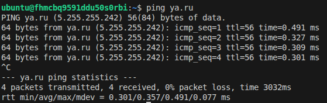

## Task 1

[vpc module](./vpc_dev/)

[main.tf](main.tf)

[route table](route-table.tf)

### Доступ в итернет из публичного хоста



### Доступ в итернет из приватного хоста (не понятно, почему в первом задании не указано, что NAT адресс у 192.168.10.254 должен быть, иначе из приватной подсети нет доступа в интернет)

```
ssh -J ubuntu@89.169.131.145 ubuntu@192.168.20.19

```


