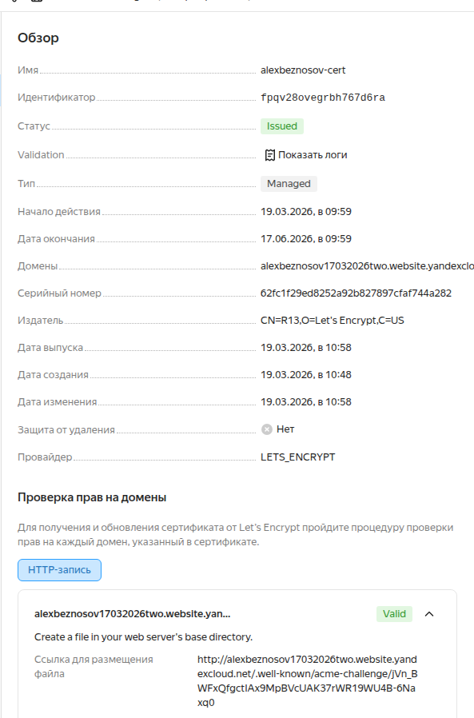
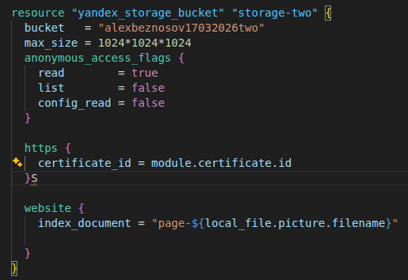
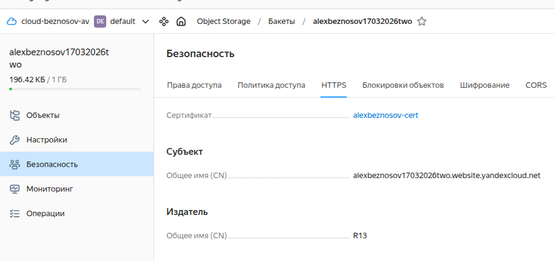
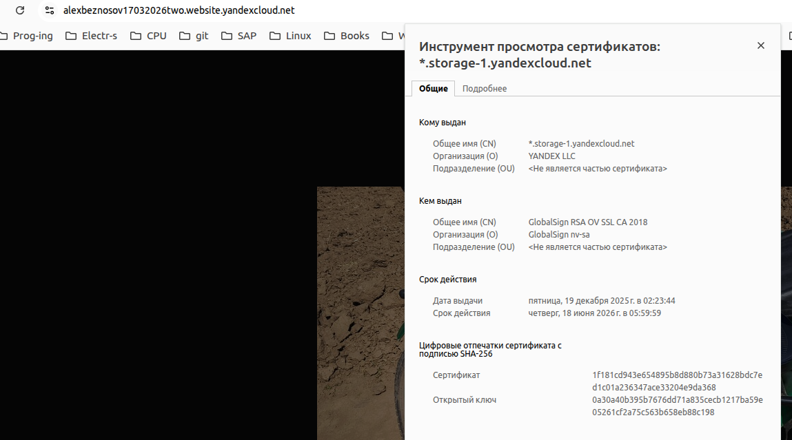

## Task 1

### 1.1

[object-storage.tf](./object-storage.tf)

### 1.2

Создал новое хранилище с веб-сайтом и https:

Добавил [сертификат](./certificate/main.tf). 

При крепил его в хранилищу:

Но, однако, при открытии моего веб-сайта сертификат подтягивается от яндекса, не мой:

